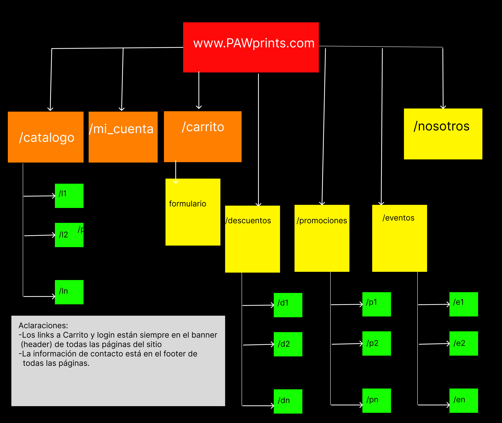

# Grupo 5 Programación en Ambiente Web

### Integrantes y autores del proyecto
- **Ausqui Mateo**
- **Cacciatore Bautista**
- **Huici Nicolás**
- **Jaime Leandro**

## Proyecto - PAWPrints
Sitio web de una libreria que cuenta con las funcionalidades:
- **Página de inicio**: presentacion de la librería, debe mostrar la tienda en línea y la física.
- **Catálogo de libros**: listado de libros que pueden comprarse en la librería.
- **Formulario de reserva de libro**: formulario donde el usuario ingresa sus datos para comprar un libro.
- **Promociones y marketing**: debe resaltarse una sección especial con información de promociones, descuentos y novedades.
- **Acerca de nosotros**: explica la historia de la librería, su misión y los servicios que ofrece.
- **Info de contacto**: dirección, telefono y e-mail de la tienda.

### Sitemap propuesto

**Pueden encontrar el proyecto Figma completo en:**
[Este enlace](https://www.figma.com/site/Jqh5CYfGCDBkZqZnToXRra/PAWPrints?node-id=0-1&t=73x0IjPEDtp84vHh-1)

## Referencias
### Para la realización del trabajo se tomaron cómo referencias las siguientes librerías:

- [Casa del libro](https://www.casadellibro.com)
- [Todos tus libros](https://www.todostuslibros.com/)
- [Yenny el ateneo](https://www.yenny-elateneo.com)
- [Cuspide](https://cuspide.com)

--
## Estructura de directorios propuesta
project-root/
├── public/                  # Document root del servidor web (única carpeta expuesta)
│   ├── index.php            # Front controller
│   ├── assets/
│   │   ├── css/
│   │   ├── js/
│   │   └── img/
│   └── favicon.ico
│
├── src/                     # Lógica de aplicación (fuera del document root)
│   ├── Controller/
│   ├── Model/
│   ├── Service/
│   ├── Repository/
│   ├── Middleware/
│   └── Router.php
│
├── views/                   # Templates PHP
│   ├── layouts/
│   │   └── main.php
│   ├── partials/
│   │   ├── header.php
│   │   └── footer.php
│   └── pages/
│       ├── home.php
│       └── error.php
│
├── config/
│   ├── app.php
│   ├── database.php
│   └── routes.php
│
├── storage/
│   ├── logs/
│   ├── cache/
│   └── uploads/
│
├── tests/
│   ├── Unit/
│   └── Integration/
│
├── scripts/                 # CLI, migraciones, seeds
│
├── vendor/                  # Si se usa Composer
│
├── .env
├── .env.example
├── .htaccess                # O nginx.conf
└── composer.json
